<h1 align="center">Hi, I'm Burak 👋</h1>

  

---

### About

- Computer Engineering graduate (Istanbul Kültür University), with an Erasmus semester at Hochschule Karlsruhe, Germany.
- Worked as a software developer at a GRC / cybersecurity consulting firm, building a compliance and audit management system used by public institutions — from local development to production deployment on a client server.
- Comfortable across the full lifecycle of a product: development, testing, security review, release management, and handover documentation.
- Particularly interested in finding root causes rather than quick patches — a bug fixed in one place and left in another isn't fixed.
- Currently open to new roles and projects.

---

### Tech Stack

  

---

### Featured Projects

<table>
<tr>
<td width="50%">

**[AlarmApp](https://github.com/Burak-Cam/AlarmApp)**

A Flutter alarm app focused on actually waking users up — designed to make snoozing difficult, with AI-based wake detection planned for a future version.

`Flutter` `Dart`

</td>
<td width="50%">

**RescueLink**

Graduation project, accepted at the ASYU 2026 conference. Details coming soon.

`Research` `ASYU 2026`

</td>
</tr>
</table>

---

### GitHub Stats

  
  

  

---

### Contribution Graph

  
  

---

### Contact

  
  

  

